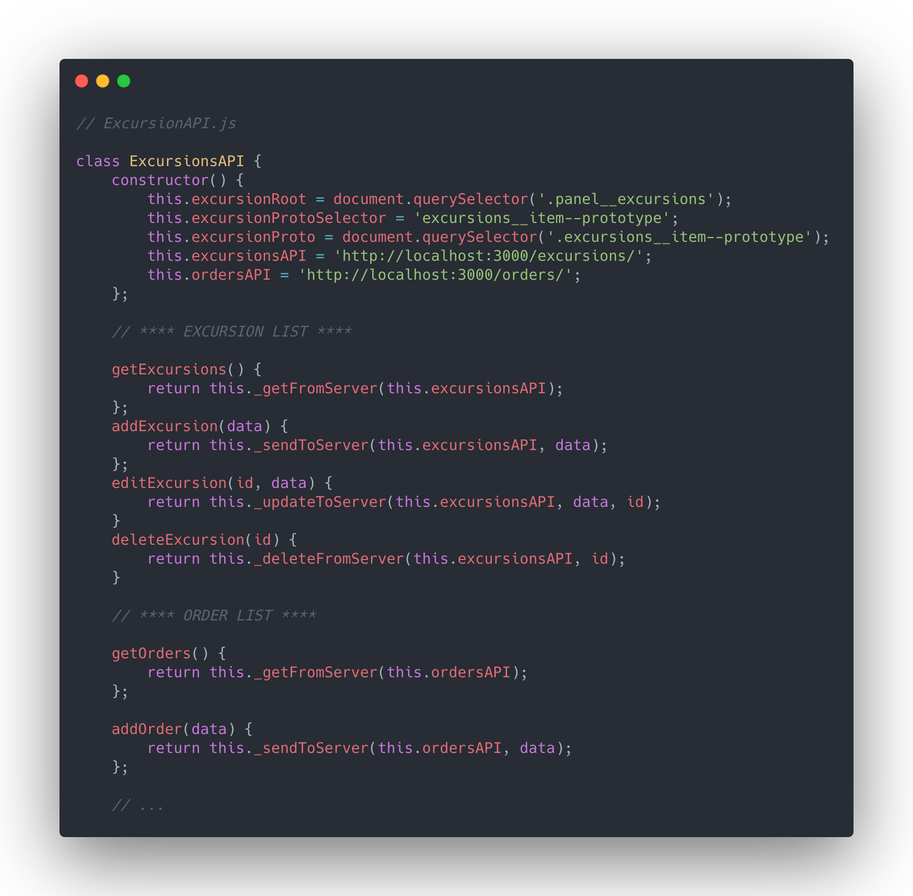
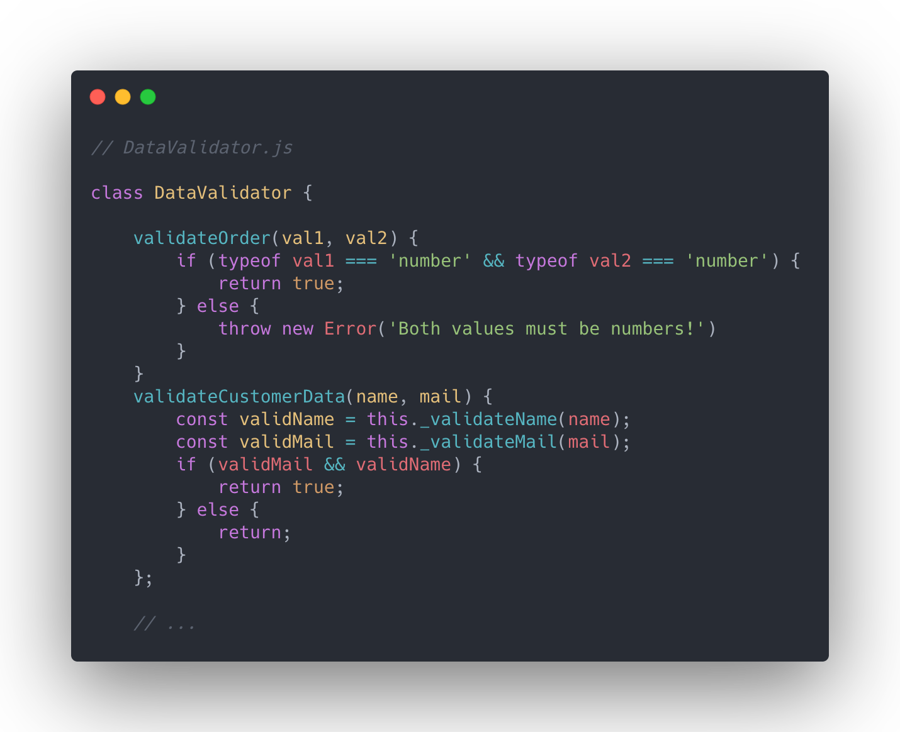

# Excursion management tool with API, fetch and async code

## Project description

Build a excursion management tool that allows to manage previously created excursions to places. There are two views - for the user/customer and for the admin. Basket functionality with automatic costs recalculation and CRUD operations. All data is stored and fetched from JSON-server.  

## Project Difficilties
- Build a simple JSON database and API handler,
- user input data Valudation provided from separate class,
- create, read, update and delete your excursions data and basket content,
- separate views for page admin and client.

## My solution

All mentioned functionality is successfully introduced.

## Notable features

- use full power of tools like Webpack, Babel, Linter,
- create Excursion Manager to handle the system,
- create DataValidator to monitor input data

## Code samples  

  

##### Build with help of Mateusz Bogolubow, [Devmentor](www.devmentor.pl).